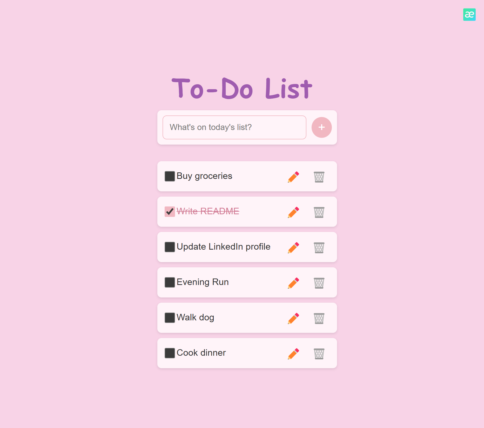

# 📝 To-Do App

A simple to-do list web application built with **React (Vercel)**, **Spring Boot (Render)**, and **PostgreSQL (Supabase)**.

## 🚀 Live Demo

🔗 [To-Do App](https://todo-react-kar.vercel.app/)

---

## 📌 Features

- Add, edit, and delete tasks
- API integration between frontend and backend
- Persistent data storage using PostgreSQL (Supabase)
- Responsive and styled with CSS
- Environment variables for security

---

## 🏗️ Project Architecture

### **Frontend (React)**

- **Framework:** React (Hosted on Vercel)
- **Components:**
  - `App.js`: Handles API requests and state management
  - `TaskList.js`: Displays tasks
  - `TaskItem.js`: Handles task actions
- **Styling:** CSS

### **Backend (Spring Boot)**

- **Framework:** Java Spring Boot (Hosted on Render)
- **Structure:**
  - `TaskController`: Manages API requests
  - `TaskService`: Handles business logic
  - `TaskRepository`: Interacts with the database
- **CORS Enabled:** Allows frontend access

### **Database (PostgreSQL)**

- **Hosted on:** Supabase
- **Tables:** Stores tasks with fields like `id`, `title`, and `status`
- **ORM Mapping:** Uses Spring Boot JPA for entity management

---

## 🛠️ Tech Stack

| Technology                                            | Usage            | Link                                                   |
| ----------------------------------------------------- | ---------------- | ------------------------------------------------------ |
| [React](https://react.dev/)                           | Frontend UI      | 🔗 [react.dev](https://react.dev/)                     |
| [Spring Boot](https://spring.io/projects/spring-boot) | Backend API      | 🔗 [spring.io](https://spring.io/projects/spring-boot) |
| [PostgreSQL](https://www.postgresql.org/)             | Database         | 🔗 [postgresql.org](https://www.postgresql.org/)       |
| [Supabase](https://supabase.com/)                     | Database Hosting | 🔗 [supabase.com](https://supabase.com/)               |
| [Render](https://render.com/)                         | Backend Hosting  | 🔗 [render.com](https://render.com/)                   |
| [Vercel](https://vercel.com/)                         | Frontend Hosting | 🔗 [vercel.com](https://vercel.com/)                   |
| [Postman](https://www.postman.com/)                   | API Testing      | 🔗 [postman.com](https://www.postman.com/)             |

---

## 🎨 Screenshots

| Home Page                                                    | Edit Mode Task |
| ------------------------------------------------------------ | -------------- |
|       | Off            |
| .png>) | On             |

## 📚 What I Have Learned

- How to build a **full-stack application**, consisting of a frontend, backend, and database.
- How to send **API requests** using [Axios](https://axios-http.com/) to pass JSON data.
- How to use **React.js** for frontend development.
- How to use **Spring Boot annotations** for backend logic and API handling.
- How to **host a full-stack app** across three platforms:
  - **Frontend**: [Vercel](https://vercel.com/)
  - **Backend**: [Render](https://render.com/)
  - **Database**: [Supabase](https://supabase.com/)
- How to use `.env` files to **hide sensitive URLs** and manage environment variables securely.

---
